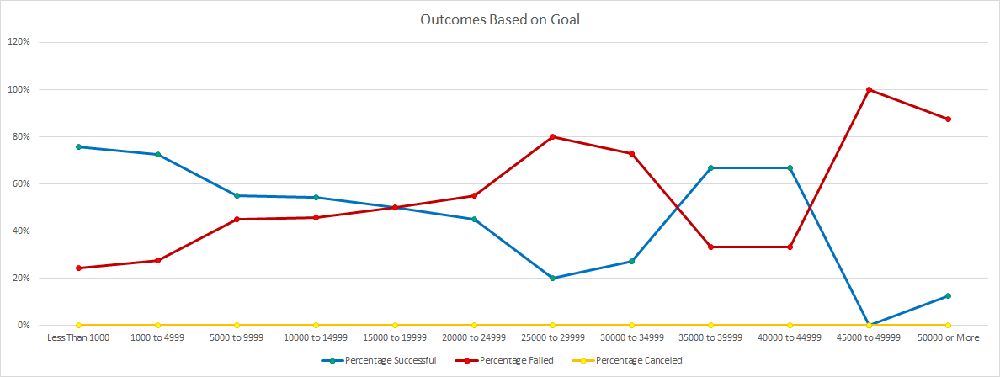

# Kickstarting with Excel

## Overview of Project
### Purpose
As the theatre play, Fever, has come close to its fundraising goal in a short amount of time. This analysis will look into how other theatre/plays campaigns compared their launch date, and if their goals contributed to their success.

## Analysis and Challenges
### Analysis of Outcomes Based on Launch Date
#### The Theatre Peak
Of the data we gathered, the analysis shows a significant amount of Kickstarter campaigns launched in May, leading with the highest amount of the year, as well as the highest success rate of 67%. As the months go by, we can see the number of campaigns and their success drop.
#### The Theatre Trough
The successful trend of Theatre Kickstarter Campaigns that peaks in May seem to arrive at a through in December, with the lowest amount of successful Kickstarter campaigns rate of 49%!

### Analysis of Outcomes Based on Goals
#### Less is More
The analysis of Kickstarter campaign outcomes based on goals found that Kickstarter campaigns with a lower goal have a greater chance of success than Kickstarter campaigns with a higher goal. That trend can be followed through except for a few campaigns around the $40,000 mark.

### Challenges and Difficulties Encountered
It may be challenging to determine the factors of success for campaigns between $35,000 - $45,000 as there are a lot fewer data points around that goal mark, and if other campaigns that set similar goals will follow the same success rate as the dataset gathered.

## Results
### Outcomes Based on Launch Date
#### Success Peaks in May
The data shows that Kickstarter campaigns started in May have the greatest influx of theatrical Kickstarter campaigns with 111 successful campaigns, 52 failed campaigns, and 3 cancelled campaigns, leading with the highest success rate of the year with 67%. Although the months [+-2] surrounding May also have a relatively high success rate with around 63%.
#### Failure in December
Although May is the most successful month of the year, December is the least, with the lowest theatre campaigns started, resulting in 37 successful, 35 unsuccessful, and 3 cancelled campaigns. The success rate of campaigns started in December is merely 49%.

We can conclude that the launch date affects the Kickstarter campaign outcome, with May being the best month to launch a Kickstarter campaign, and December being the worst.

### Outcomes Based on Goals
#### Ask for less
Kickstarter campaigns with lower goals have a greater chance of success, leading with 76% campaign success under the $1,000 mark. Although there are 9 campaigns between $35,000 and $45,000 that have a success rate of 67%, the trend continues down to 13% success for Kickstarter campaigns with goals of $50,000 and above.

From the analysis, we can conclude that Kickstarter campaigns with a lower goal have a higher chance of success than campaigns with a higher goal.

### Dataset Limitations
- There are not enough data points around the Kickstarter campaign goal amount of $35,000 to $45,000 to determine the success of these Kickstarter campaigns, and if other campaigns with similar goals with reach the same level of success.
- The Kickstarter rewards are not included in this dataset, which could prove a useful factor in determining the success of Kickstarter campaigns.
- The dataset contains limited data from year 2010 to 2017, which limits our reach for relevant data as trends and statistics change over time. Adding additional years to our dataset would increase our sample size, and improve its statistical accuracy.

### Recommendation for additional tables or graphs
- It would be useful to provide an additional graph showing the success rate percentage of Kickstarter campaigns based on their launch date, as the current graph can be misleading and might provide the reader with a bias toward the Kickstarter popularity of a month instead of the success rate of a month.
- A table showing the average donation based on the number of donors for successful Kickstarter campaigns could show how much people are willing to pledge to a Kickstarter campaign and what rewards a Kickstarter campaign should focus on.
- Add tables and graphs on how successful campaigns pledged versus their goals, further analyzing if there are any correlation between Kickstarter start dates and their pledged amounts, and Kickstarter goals and their pledged amounts.
